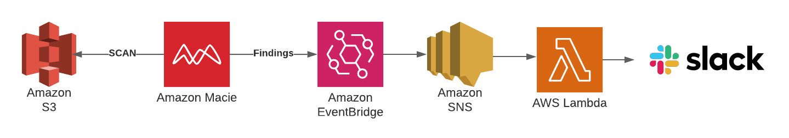

# AWS Macie Slack Alerts

This is a demonstration of:
1. Using AWS Macie to detect PII in S3 buckets
2. Publishing messages to slack when Macie finds said PII

## How It Works

We create some mock PII data with:
* names
* addresses
* SSNs

And put that data into a `super-secret` s3 bucket two ways:
* Once with SS KMS encryption
* Once with no encryption

We then enable AWS Macie in the AWS account and spin up a one-time job to scan our `super-secret` S3 bucket.

AWS Macie has built in classifiers for common PII data (eg. SSN).

The following happens after the scan:
1. The Macie job will create some findings
2. Eventbridge will look for findings from `aws.macie` and forward to an SNS topic
3. A lambda function will receive a message from SNS and send a request to our preconfigured slack webhook
